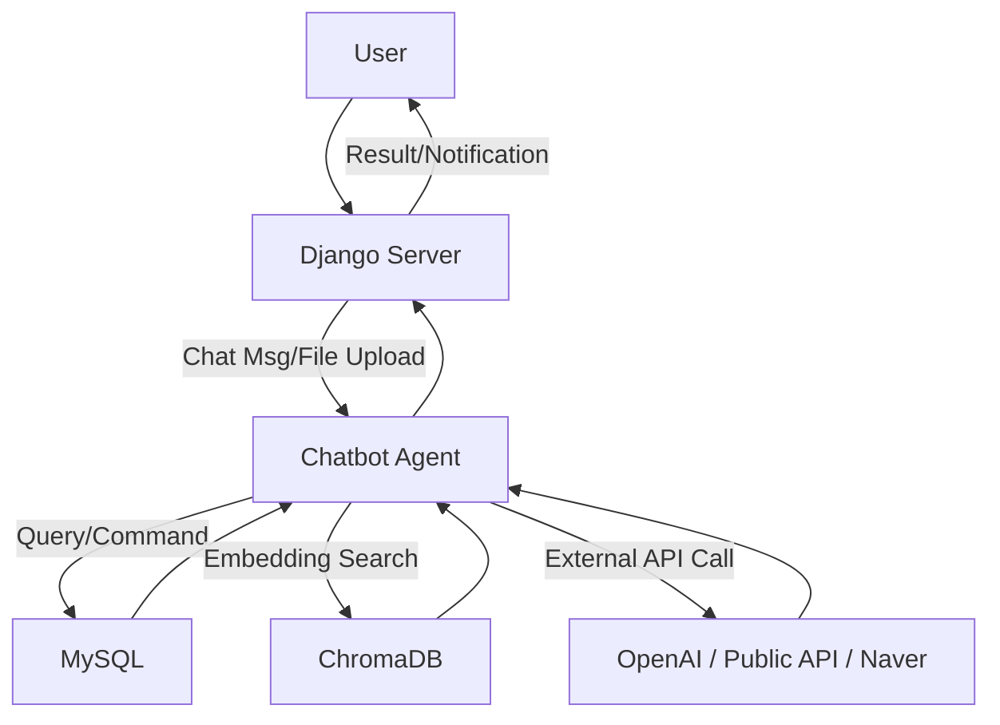

<h1 style="all:unset; font-size:2em;">시스템 아키텍처 (SKN13-4TH-1TEAM)</h1>


### 팀 소개
 ### 팀 명 : 지금 서울
### 🗓️ 개발 기간
> 2025.07.21 ~ 2025.07.22
### 👥 팀원

<table width="100%">
  <tr>
    <td align="center" width="20%">
      
    </td>
    <td align="center" width="20%">
      
    </td>
    <td align="center" width="20%">
      
    </td>
    <td align="center" width="20%">
      
    </td>
    <td align="center" width="20%">
      
    </td>
  <tr>

  <tr>
    <td align="center" width="20%">
      <b>남궁건우</b>
    </td>
    <td align="center" width="20%">
      <b>우지훈</b>
    </td>
    <td align="center" width="20%">
      <b>이명인</b>
    </td>
    <td align="center" width="20%">
      <b>홍채우</b>
    </td>
    <td align="center" width="20%">
      <b>김승호</b>
    </td>
  </tr>

  <tr>
    <td align="center" width="20%">
      <a href="https://github.com/NGGW519">
        
      </a>
    </td>
    <td align="center" width="20%">
      <a href="https://github.com/WooZhoon">
        
      </a>
    </td>
    <td align="center" width="20%">
      <a href="https://github.com/leemyeongin2416">
        
      </a>
    </td>
    <td align="center" width="20%">
      <a href="https://github.com/HCWDDD">
        
      </a>
    </td>
    <td align="center" width="20%">
      <a href="https://github.com/qqqppma">
        
      </a>
    </td>
  </tr>
</table>

## 1. 프로젝트 개요

### 프로젝트 명  
**서울시 실시간 정보 기반 생활 챗봇 시스템**

---

### 주제  
**서울시 열린데이터 및 120다산콜 FAQ를 활용한 시민 맞춤형 챗봇 개발**

---

### 주제를 선택한 이유  

- **시민 수요 기반**: 서울시민은 미세먼지, 따릉이, 날씨, 주차 등 생활 정보에 대한 실시간 수요가 높음  
- **정보 접근의 어려움**: 서울시가 다양한 공공 데이터를 제공하고 있지만, 일반 시민이 이를 API나 포털에서 직접 찾기엔 번거로움  
- **FAQ의 반복성**: 120다산콜센터에는 동일하거나 유사한 질문이 반복적으로 접수되고 있어 자동응답 수요가 있음  
- **자연어 기반 접근성**: 챗봇을 통해 누구나 자연어로 질문하고 실시간으로 응답받을 수 있는 구조를 제공하면 정보 접근성이 대폭 향상됨

---

### 주요 기능 요약  

| 분류       | 주요 기능 |
|------------|-----------|
| 실시간 데이터 | 열린데이터광장의 API를 통해 실시간 인구, 날씨, 주차, 대중교통 등 정보 제공 |
| FAQ 응답     | 120다산콜 FAQ 데이터를 기반으로 반복 질문에 자동 응답 |
| 질문 분류     | 입력된 질문을 실시간/FAQ/기타로 분류해 적절한 응답 경로 연결 |
| 관리자 기능  | 응답 로그 관리 기능 포함 |

---

### 기대 효과  

- 시민의 정보 접근성 향상 및 120콜센터의 민원 분산  
- 실시간 공공데이터의 활용성 증대  
- 서울시 행정 서비스의 자동화 기반 마련

## 2. 요구사항 명세서

---

| 요구사항 ID | 요구유형 | 요구 주체 | 요구사항명           | 요구사항 내용 | 중요도 |
|-------------|----------|-------------|----------------------|-----------------------------------------------------------------------------------------------------------------------------------------------------------|--------|
| REQ-F01     | 기능     | 사용자        | 실시간 데이터 응답   | 사용자가 “여의도 주차 상황 알려줘”, “광화문 날씨 어때?”와 같은 질문 시, 열린데이터광장([link](https://data.seoul.go.kr/dataVisual/seoul/guide.do)) API를 통해 실시간 정보 제공 | 상     |
| REQ-F02     | 기능     | 사용자        | FAQ 자동 응답       | 사용자가 "기후동행카드는 어떻게 써?" 등 질문 시, 서울시 정보공개포털 FAQ([link](https://opengov.seoul.go.kr/civilappeal/list?page=27)) 데이터 기반 자동 응답 | 상     |
| REQ-F04     | 기능     | 사용자        | 챗봇 대화 UI         | 챗 인터페이스를 통해 사용자가 직관적으로 질문하고 응답을 받을 수 있어야 함 | 중     |
| REQ-F03     | 기능     | 시스템        | 질문 분류 기능       | 입력된 질문을 실시간 정보, FAQ, 일반 문의로 자동 분류하여 처리 경로를 결정 | 상     |
| REQ-F05     | 기능     | 시스템        | 관리자 기능          | 관리자 페이지를 통해 FAQ 등록/수정, 응답 기록 확인, 인기 질문 통계 등을 제공 | 중     |
| REQ-NF02    | 비기능   | 사용자        | 반응형 웹 지원       | PC, 모바일, 태블릿 등 다양한 기기에서 UI가 자동으로 최적화되어야 함 | 상     |
| REQ-NF05    | 비기능   | 사용자        | 개인정보 비수집 고지 | 사용자 개인정보를 저장하지 않으며, 이를 명확히 고지해야 함 | 중     |
| REQ-NF01    | 비기능   | 시스템        | 응답 속도            | 전체 응답 처리 시간이 평균 2초 이내여야 함 | 상     |
| REQ-NF03    | 비기능   | 시스템        | API 오류 처리        | 외부 API 오류 발생 시 사용자에게 안내 메시지를 제공해야 함 | 상     |
| REQ-NF04    | 비기능   | 시스템        | 보안 정책 적용       | HTTPS 사용 및 Django 보안 설정을 적용해야 함 | 중     |

## 3. 전체 구조 개요

본 프로젝트는 **행정 QnA 및 실시간 생활 정보 챗봇 서비스**로, Django 기반 웹 백엔드와 LLM·RAG 기반 AI, MySQL·ChromaDB 등 다양한 데이터 소스와 연동되는 구조입니다.

```
[사용자] ⇄ [Django 웹서버] ⇄ [챗봇 에이전트/LLM] ⇄ [DB/벡터스토어/API]
```

- Direstory Structure

```python
SKN13-4th-1TEAM/
├── chat_agent.py
├── chatbot_web/
│   ├── chatbot_web
│   │   ├── settings.py
│   │   ├── urls.py
│   │   └── ...
│   ├── main/
│   │   ├── __init__.py
│   │   ├── admin.py
│   │   ├── apps.py
│   │   ├── forms.py
│   │   ├── migrations
│   │   ├── mock_data
│   │   ├── models.py
│   │   ├── static/
│   │   │   └── main/
│   │   │       ├── board_detail.css
│   │   │       ├── board_form.css
│   │   │       └── ...
│   │   ├── templates/
│   │   │   └── main
│   │   │       ├── base.html
│   │   │       ├── chatbot.html
│   │   │       ├── login.html
│   │   │       ├── js/
│   │   │       │   ├── chatbot.js
│   │   │       │   ├── job_page.js
│   │   │       │   └── ...
│   │   │       └── ...
│   │   ├── tests.py
│   │   ├── urls.py
│   │   └── views.py
│   ├── manage.py
│   └── staticfiles/
│       ├── admin
│       └── main
├── create_engine.py
├── dataset
├── Drafts
├── llm_tools/
│   ├── chat_history_manager.py
│   ├── get_weather.py
│   ├── google_places.py
│   ├── naver_search.py
│   ├── retriever.py
│   └── sEOUl.py
├── README.md
├── requirements.txt
├── system_prompt.py
├── SYSTEM_ARCHITECTURE.md
└── chromadb_dataset.py
```

---

## 4. 주요 컴포넌트 및 역할

### 1) 프론트엔드 (Django Template)
- 사용자 로그인/회원가입, 챗봇 UI, 지도 기반 정보 조회, 게시판 등 제공
- 파일 업로드, 실시간 채팅, 추천/알림 등 인터랙션 지원

### 2) 백엔드 (Django)
- RESTful API 및 웹페이지 라우팅
- 사용자 인증/세션 관리
- 챗봇 요청 처리 및 대화 이력 관리
- 파일 업로드/다운로드, 알림 등 부가 기능

### 3) 챗봇 에이전트 (LangChain + LangGraph)
- 사용자 메시지 수신 → 프롬프트/도구 조합 → LLM 호출 및 응답 생성
- 다양한 툴(RAG, 네이버검색, 서울시 실시간 도시데이터 등)과 연동
- 대화 상태(State) 관리 및 히스토리 저장

### 4) 데이터베이스
- **MySQL**: 사용자, 게시글, 댓글, 알림, 챗봇 세션 등 구조적 데이터 저장
- **ChromaDB**: 120다산콜센터에서 관리하고 있는 '자주 묻는 질문' QnA 임베딩 벡터 저장(RAG 검색용)

### 5) 외부 API/데이터
- **OpenAI API**: LLM(예: GPT-4) 호출
- **공공데이터포털/서울시 열린데이터광장 API**: 실시간 인구,실시간 교통, 날씨, 문화행사 등 정보
- **네이버/구글 API**: 장소, 뉴스, 블로그 등 검색

### 6) 크롤러/데이터 파이프라인
- Selenium, BeautifulSoup 등으로 행정 QnA/뉴스/민원 데이터 수집 및 전처리
- Pandas 등으로 데이터 정제 및 저장

---

## 5. 데이터 및 서비스 흐름



---

## 6. 기술 스택

| 구분         | 주요 기술/서비스                      |
| ------------ | ------------------------------------- |
| 백엔드       |  
| 프론트엔드   |    
| 챗봇/AI      |   
| DB           |  
| 크롤링/ETL   |   
| 배포/운영     |    

---

## 7. 인프라/운영 구조
- 리눅스 서버(AWS EC2 등)에 Python/Django 환경 구축
- MySQL, ChromaDB 등 데이터베이스 별도 운영
- .env 파일로 API KEY, DB 정보 등 환경변수 관리
- requirements.txt로 패키지 일괄 설치
- 크롬드라이버 등 외부 바이너리 별도 설치 필요

---

## 8. 보안 및 확장성
- CSRF, 세션, 인증 등 Django 기본 보안 적용
- API KEY, DB 비밀번호 등은 .env로 분리 관리
- 벡터스토어/LLM/외부API 등 모듈화로 기능 확장 용이

---

## 9. 기타 참고
- 상세 UI/UX, 데이터 파이프라인, 정책 보고서 자동화 등은 Drafts/ 폴더 내 문서 참고
- 실제 배포 시 requirements.txt, .env, DB 마이그레이션 등 필수 적용 
