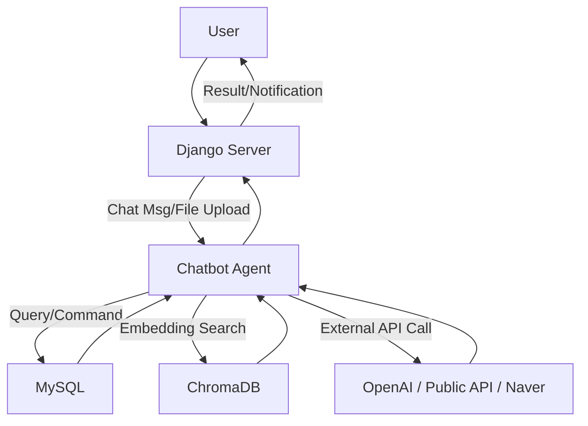

# 시스템 아키텍처 (SKN13-4TH-1TEAM)

---

## 1. 전체 구조 개요

본 프로젝트는 **행정 QnA 및 실시간 생활 정보 챗봇 서비스**로, Django 기반 웹 백엔드와 LLM·RAG 기반 AI, MySQL·ChromaDB 등 다양한 데이터 소스와 연동되는 구조입니다.

```
[사용자] ⇄ [Django 웹서버] ⇄ [챗봇 에이전트/LLM] ⇄ [DB/벡터스토어/API]
```

- Direstory Structure

```python
SKN13-4th-1TEAM/
├── chat_agent.py
├── chatbot_web/
│   ├── chatbot_web
│   │   ├── settings.py
│   │   ├── urls.py
│   │   └── ...
│   ├── main/
│   │   ├── __init__.py
│   │   ├── admin.py
│   │   ├── apps.py
│   │   ├── forms.py
│   │   ├── migrations
│   │   ├── mock_data
│   │   ├── models.py
│   │   ├── static/
│   │   │   └── main/
│   │   │       ├── board_detail.css
│   │   │       ├── board_form.css
│   │   │       └── ...
│   │   ├── templates/
│   │   │   └── main
│   │   │       ├── base.html
│   │   │       ├── chatbot.html
│   │   │       ├── login.html
│   │   │       ├── js/
│   │   │       │   ├── chatbot.js
│   │   │       │   ├── job_page.js
│   │   │       │   └── ...
│   │   │       └── ...
│   │   ├── tests.py
│   │   ├── urls.py
│   │   └── views.py
│   ├── manage.py
│   └── staticfiles/
│       ├── admin
│       └── main
├── create_engine.py
├── dataset
├── Drafts
├── llm_tools/
│   ├── chat_history_manager.py
│   ├── get_weather.py
│   ├── google_places.py
│   ├── naver_search.py
│   ├── retriever.py
│   └── sEOUl.py
├── README.md
├── requirements.txt
├── system_prompt.py
├── SYSTEM_ARCHITECTURE.md
└── chromadb_dataset.py
```

---

## 2. 주요 컴포넌트 및 역할

### 1) 프론트엔드 (Django Template)
- 사용자 로그인/회원가입, 챗봇 UI, 지도 기반 정보 조회, 게시판 등 제공
- 파일 업로드, 실시간 채팅, 추천/알림 등 인터랙션 지원

### 2) 백엔드 (Django)
- RESTful API 및 웹페이지 라우팅
- 사용자 인증/세션 관리
- 챗봇 요청 처리 및 대화 이력 관리
- 파일 업로드/다운로드, 알림 등 부가 기능

### 3) 챗봇 에이전트 (LangChain + LangGraph)
- 사용자 메시지 수신 → 프롬프트/도구 조합 → LLM 호출 및 응답 생성
- 다양한 툴(RAG, 네이버검색, 서울시 실시간 도시데이터 등)과 연동
- 대화 상태(State) 관리 및 히스토리 저장

### 4) 데이터베이스
- **MySQL**: 사용자, 게시글, 댓글, 알림, 챗봇 세션 등 구조적 데이터 저장
- **ChromaDB**: 120다산콜센터에서 관리하고 있는 '자주 묻는 질문' QnA 임베딩 벡터 저장(RAG 검색용)

### 5) 외부 API/데이터
- **OpenAI API**: LLM(예: GPT-4) 호출
- **공공데이터포털/서울시 열린데이터광장 API**: 실시간 인구,실시간 교통, 날씨, 문화행사 등 정보
- **네이버/구글 API**: 장소, 뉴스, 블로그 등 검색

### 6) 크롤러/데이터 파이프라인
- Selenium, BeautifulSoup 등으로 행정 QnA/뉴스/민원 데이터 수집 및 전처리
- Pandas 등으로 데이터 정제 및 저장

---

## 3. 데이터 및 서비스 흐름



---

## 4. 기술 스택

| 구분         | 주요 기술/서비스                      |
| ------------ | ------------------------------------- |
| 백엔드       |  
| 프론트엔드   |    
| 챗봇/AI      |   
| DB           |  
| 크롤링/ETL   |   
| 배포/운영     |    

---

## 5. 인프라/운영 구조
- 리눅스 서버(AWS EC2 등)에 Python/Django 환경 구축
- MySQL, ChromaDB 등 데이터베이스 별도 운영
- .env 파일로 API KEY, DB 정보 등 환경변수 관리
- requirements.txt로 패키지 일괄 설치
- 크롬드라이버 등 외부 바이너리 별도 설치 필요

---

## 6. 보안 및 확장성
- CSRF, 세션, 인증 등 Django 기본 보안 적용
- API KEY, DB 비밀번호 등은 .env로 분리 관리
- 벡터스토어/LLM/외부API 등 모듈화로 기능 확장 용이

---

## 7. 기타 참고
- 상세 UI/UX, 데이터 파이프라인, 정책 보고서 자동화 등은 Drafts/ 폴더 내 문서 참고
- 실제 배포 시 requirements.txt, .env, DB 마이그레이션 등 필수 적용 
